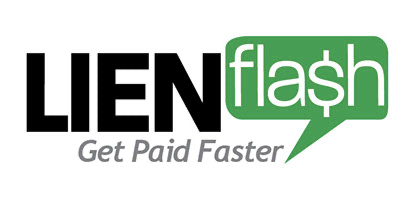

# Lien Flash

[![Contributors][contributors-shield]][contributors-url]
[![Forks][forks-shield]][forks-url]
[![Stargazers][stars-shield]][stars-url]
[![Issues][issues-shield]][issues-url]

## Table of Contents

- [Brief Description](#brief-description)
- [How to use](#how-to-use)
- [Installation](#installation)
- [Background Information](#background-information)
- [Functionality](#functionality)
- [Next Steps](#next-steps)
- [Authors](#authors)
- [Acknowledgements and Resources](#acknowledgements-and-resources)

<!-- Brief Description -->

## Brief Description
We have created an app that allows a user to create a job, track that job in the lien process, and submit the job info to an administrator when they are ready to submit a Notice of Intent, Lien, or Release of Lien.

## How to Use
When a user logs in, they are brought to a homepage where they can add a job, check for Notice of Intent eligible jobs, check their lien filed jobs & release eligible jobs. Within the listed jobs, if they are in the correct time period, they can click a button to submit a request to an administrator to file their documents legally. Users can also check out their profile to see what their information is in the system.

Users can also create an account if they don't already have one.

Admin can log in and see all jobs all user's input, and see where they are in the lien process. They can get more details on a job and click a button to change where the job is in in the lien process if the admin has completed their paperwork for it.

## Background Information
This was a client backed project built for lawyers. The focus for our MVP was to create a viable user interface to give our client a basis to build the app out more in the future.

## Built With

- React 17
- Redux 4
- SASS/SCSS
- Material UI data table for admin view

## Installation

**Fork this repository:**

https://github.com/lienflash/lienflash-fe

**Clone your forked repository**

`git clone` and the copied URL

**Change into the directory and install the project dependencies**

`cd` into directory and run `npm install` for dependencies

### How to see the product

In terminal, go to the project directory and run 'npm start' to open the project in the browser. Use email1234@gmail.com and password1 to log in and check out functionality.

### Live version

[Deployed Site](https://lienflash.herokuapp.com/)

## Functionality

### Opening Page & Logging In

### Add A Job

### Checking Eligible Jobs

### Viewing Profile Info & Logging Out

## Next Steps
- Allow a user to edit their information - profile and jobs they've created
- Improve PWA with background sync and push notifications
- Enabling payment for user subscription & filing legal documents
- Automatically finding correct county for jobs

## Authors

👤 **Taryn Martin**
- Github: [tarynmartin](https://github.com/tarynmartin)
- LinkedIn: [Taryn](https://www.linkedin.com/in/tarynmartin919/)

👤 **Stephanie Norton**
- Github: [NakiNorton](https://github.com/NakiNorton)
- LinkedIn: [Stephanie](https://www.linkedin.com/in/stephanie-norton-12888453/)

## Acknowledgements and Resources

[Original Project Link](https://mod4.turing.io/projects/capstone.html)

<!-- MARKDOWN LINKS & IMAGES -->

[contributors-shield]: https://img.shields.io/github/contributors/lienflash/lienflash-fe.svg?style=flat-square
[contributors-url]: https://github.com/lienflash/lienflash-fe/graphs/contributors
[forks-shield]: https://img.shields.io/github/forks/lienflash/lienflash-fe.svg?style=flat-square
[forks-url]: https://github.com/lienflash/lienflash-fe/network/members
[stars-shield]: https://img.shields.io/github/stars/lienflash/lienflash-fe.svg?style=flat-square
[stars-url]: https://github.com/lienflash/lienflash-fe/stargazers
